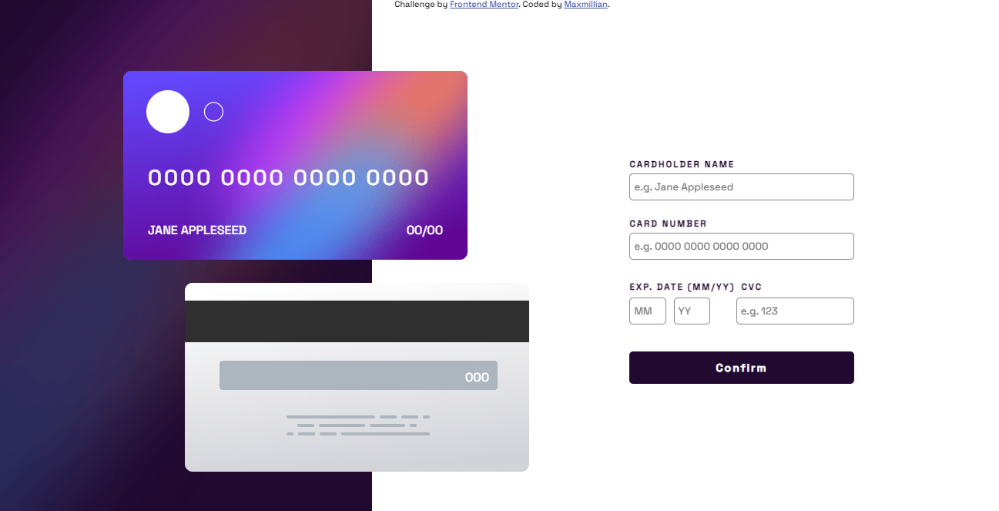
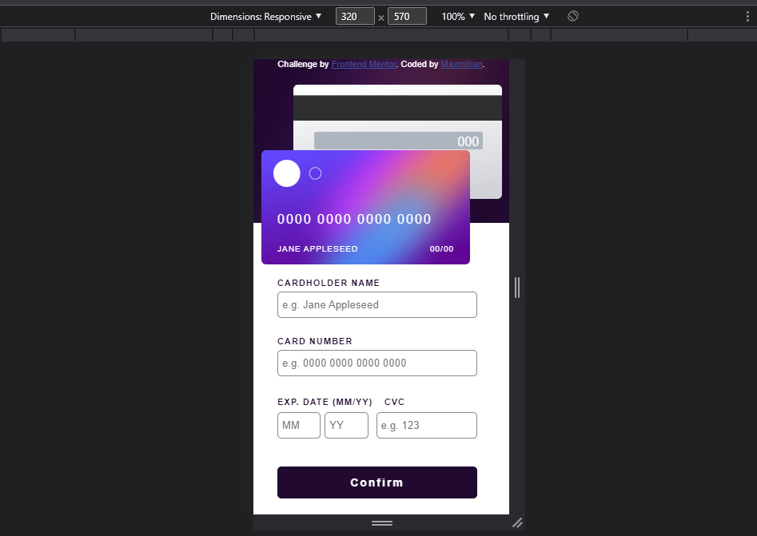
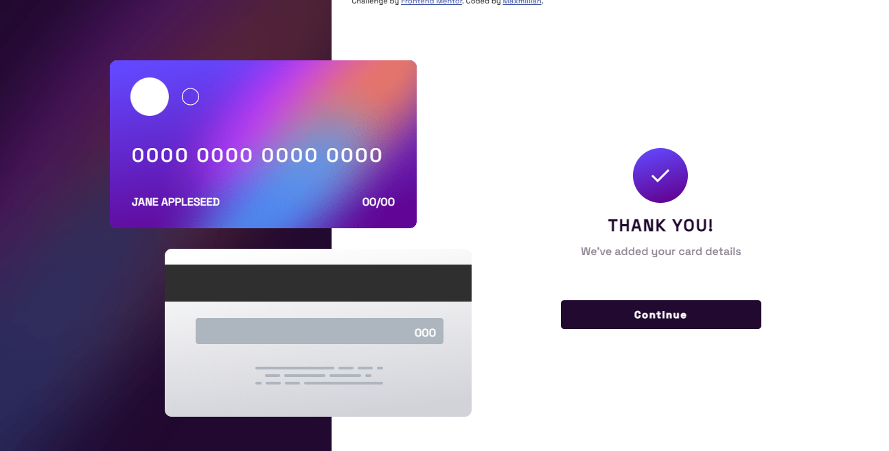
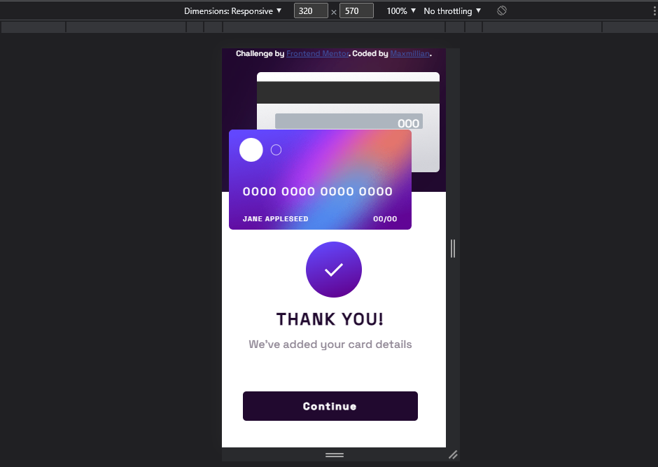

# Interactive card details form solution- from Frontend Mentor

This is a solution to the [Interactive card details form challenge on Frontend Mentor](https://www.frontendmentor.io/challenges/interactive-card-details-form-XpS8cKZDWw). Frontend Mentor challenges help you improve your coding skills by building realistic projects. 

## Table of contents

- [Overview](#overview)
  - [The challenge](#the-challenge)
  - [Screenshot](#screenshot)
  - [Links](#links)
- [My process](#my-process)
  - [Continued Development](#continued-development)
  - [Built with](#built-with)
  - [How To Use Markdown](how-to-use-markdown)
- [Author](#author)

## Overview

### The challenge

Users should be able to:

- Fill in the form and see the card details update in real-time
- Receive error messages before the form is submitted if:
  - Any input field is empty
  - The card number, expiry date, or CVC fields are in the wrong format
- View the optimal layout depending on their device's screen size
- See hover, active, and focus states for interactive elements on the page

### Screenshot

### Links

- Solution URL: (https://github.com/MaxKolbe/Virtual-Credit-Card)
- Live Site URL: (https://maxkolbe.github.io/Virtual-Credit-Card/)

## My process

### Continued Development
This project is still open for improvements with time, I hope to keep updating and adding relevant properties to this project.

### Built with

- Semantic HTML5 markup
- CSS custom properties
- Flexbox
- Mobile-first workflow
- Vanilla Javascript

### How To Use Markdown

Check out [The Markdown Guide](https://www.markdownguide.org/) to learn more about Markdown.

## Author

- Frontend Mentor - [@MaxKolbe](https://www.frontendmentor.io/profile/MaxKolbe)
- Github- [@MaxKolbe](https://github.com/MaxKolbe)

